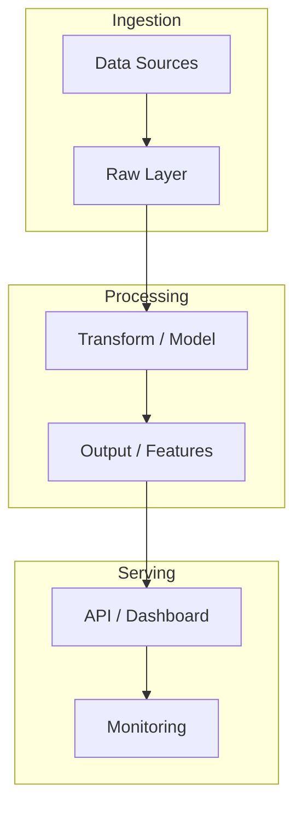

# bloomberg-market-pulse-ai

> Real-time market data pipeline from Bloomberg API. LSTM (PyTorch) for pattern detection and automated financial signals on AWS. Bloomberg API in productive pipeline.

**Stack:** Bloomberg API · AWS S3 · Lambda · EC2 · PyTorch · LSTM · FastAPI

**KPIs:** Real-time ingest · Bloomberg API · LSTM signals

---

## Problem Statement

<!-- Describe the business problem this project solves -->

## Architecture



## Tech Decisions & Trade-offs

| Decision | Choice | Reason |
|----------|--------|--------|
|          |        |        |

## Results

| Metric | Value |
|--------|-------|
| KPI 1  | —     |
| KPI 2  | —     |

## How to Run

```bash
git clone https://github.com/lcarrenoy/bloomberg-market-pulse-ai.git
cd bloomberg-market-pulse-ai
uv sync
cp .env.example .env
uv run python src/main.py
```

---

*Part of [Luis Carreño's Portfolio](https://github.com/lcarrenoy) · AI Engineer · Financial Engineering · Score 9.8/10*
